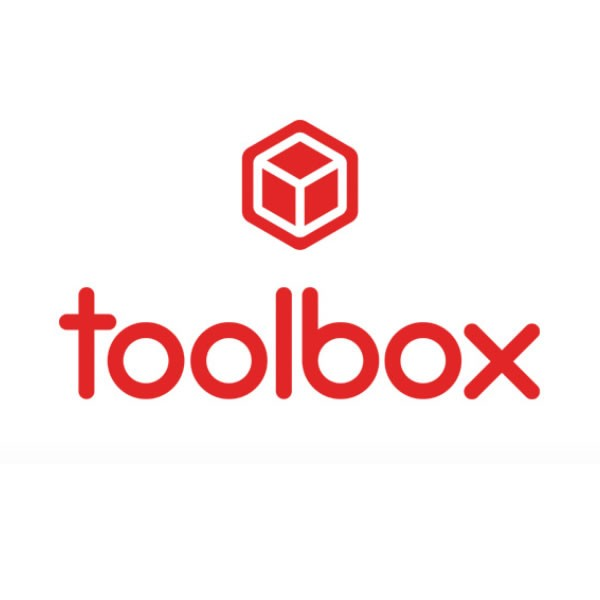
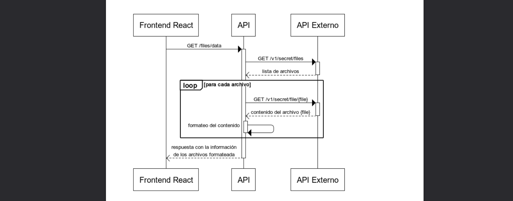
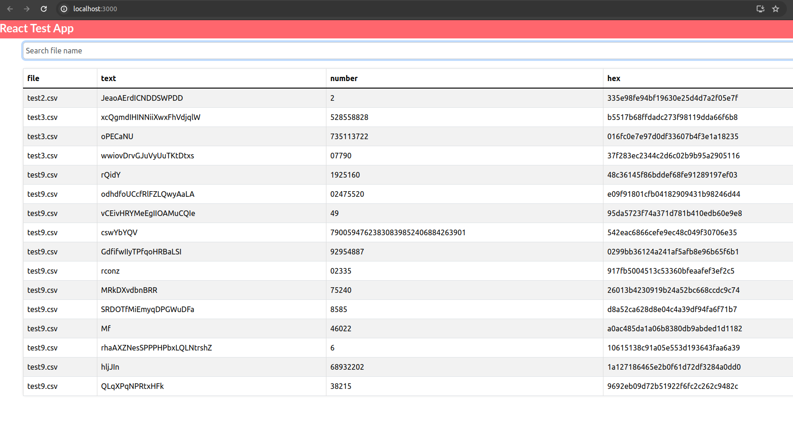
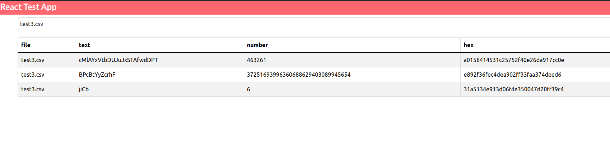

# <h1 align="center">
  <br>
   <a align="center" href=""></a>
</h1>

<h4 align="center">ToolBoxTest es un proyecto que utiliza Docker para ejecutar dos subproyectos: un back-end en Node.js y Express y un front-end en React.</h4>

<p align="center">
  <a href="">
    
  </a>
  <a href="">
    
  </a>
  <a href="">
    
  </a>
  <a href="">
    
  </a>
  <a href="">
    
  </a>
  <a href="">
    
  </a>
  <a href="">
    
  </a>
</p>


## 📚 Documentación
Consulta la [Documentación](https://tbxnet.applytojob.com/questionnaire/5fb6954bc1c6f/prospect_20240119170406_6ZKWUPJSILNUASL7/projob_20240119170406_KYYG56YA7TJO62YK) para obtener más detalles.

## 📄 Estructura del proyecto
```bash
├── docker-compose.yml
├── tool-box-back
│   ├── Dockerfile
│   ├── package.json
│   └── src
└── tool-box-front
    ├── Dockerfile
    ├── package.json
    └── src
```

## 📈 Diagrama


## 📱 Mockups



## 🏃‍♂️ Cómo ejecutar

Para clonar y ejecutar esta aplicación, necesitarás [Git](https://git-scm.com) y [Node.js](https://nodejs.org/en/download/) (que incluye [npm](http://npmjs.com)). Desde tu línea de comandos:


```bash
# Clonar repositorio
$ git clone https://github.com/tu_usuario/ToolBoxTest

# Entra en el repositorio o raiz del proyecto
$ cd ToolBoxTest
```

* ## 💻 Ejecucion de Front o Back por separado 

```bash
# Instalar dependencias
$ npm install

# Ejecutar docker
$ sudo docker-compose up --build
```

* ## 🐳 Ejecucion con Docker
  **Puertos**
    - Back-end: 4001
    - Front-end: 3000

```bash
#Instalar las dependencias en cada subproyecto:
$ cd tool-box-back && npm install
$ cd tool-box-front && npm install

#Iniciar el back-end:
$ cd tool-box-back && npm start

#Iniciar el front-end:
$ cd tool-box-front && npm start
```

## 📩 Correo electrónico

Es decir, si te gustó usar esta aplicación o te ayudó de alguna manera, me gustaría que me envíes un correo electrónico a <nicolaievbrito@gmail.com> sobre cualquier cosa que quieras decir sobre este software. ¡Realmente lo apreciaría!

## 🙌 Créditos y tecnologías

Este software utiliza los siguientes paquetes de código abierto:


* [Node](https://nodejs.org/)
* [Express](https://expressjs.com/)
* [React](https://reactjs.org/)
* [Mocha](https://mochajs.org/)
* [Chai](https://www.chaijs.com/)
* [Jest](https://jestjs.io/)
* [Docker](https://www.docker.com/)

**Librerías adicionales:**

* [Axios](https://github.com/axios/axios)

**Herramientas:**

* [Postman](https://www.postman.com/)

## 🔧 Support
<nicolaievbrito@gmail.com>

---

> GitHub [@nicolaievpustelnik](https://github.com/nicolaievpustelnik) &nbsp;
